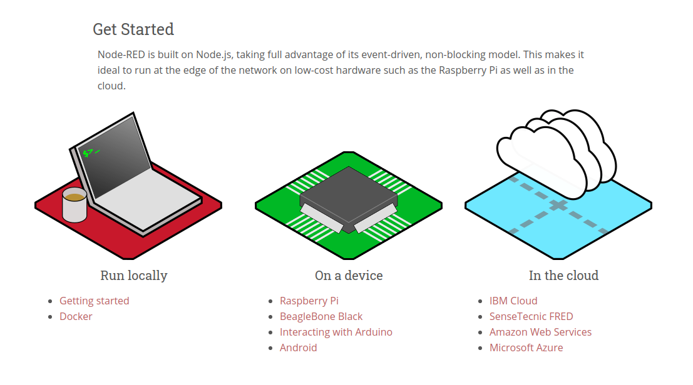

# New Document

## Node-RED running in an AWS environment.


To get started, follow the instructions on site:
https://nodered.org/




"In the cloud", click in "Amazon Web Services"


Installation of EB Command Line for script:
https://github.com/aws/aws-elastic-beanstalk-cli-setup

2.1. Clone this repository
Use the following:

```
git clone https://github.com/aws/aws-elastic-beanstalk-cli-setup.git
```
On Ubuntu and Debian, run the following command to install dependencies.
```
apt-get install \
    build-essential zlib1g-dev libssl-dev libncurses-dev \
    libffi-dev libsqlite3-dev libreadline-dev libbz2-dev
```
